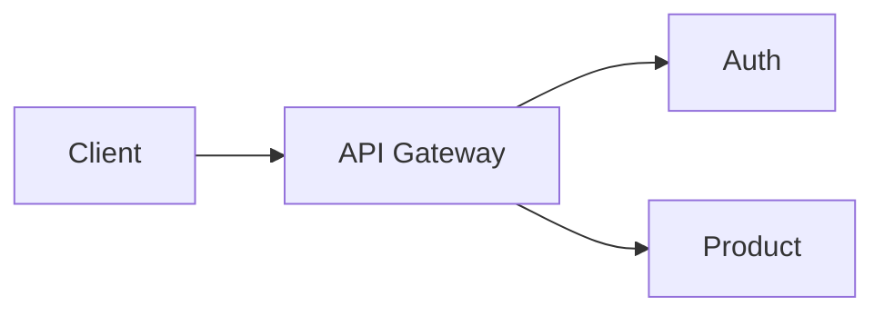

# Documentation Style Guide

How we write docs in this repo. Read this once before adding new pages.

## Voice
- Write for someone smart who's new to this project.
- **Explain WHY first, HOW second.** Anyone can Google the *how*; the *why* is what makes the doc valuable.
- Show, don't just tell — every concept gets a code or command example from this repo.

## Structure every doc should follow
1. **One-sentence summary** at the top.
2. **Why this exists / why it matters** (the WHY).
3. **The concept / explanation.**
4. **Example from THIS project** — real file paths, real commands.
5. **Common pitfalls** if applicable.
6. **References** — links to related docs.

## Formatting rules
- Code blocks always have a language tag: \`\`\`bash, \`\`\`go, \`\`\`yaml.
- Commands shown as the user would type them, with a comment above explaining intent.
- Use tables for comparisons (X vs Y) — easier to scan than prose.
- Callouts:
  > ⚠️ Warning — destructive command.
  > 💡 Tip — non-obvious shortcut.
  > 📌 Note — important detail you might miss.

## File-path references
When pointing at code, use `path/file.go:42` so editors/IDEs can jump straight to the line.

## Diagrams
Prefer ASCII for portability:

```
[Client] --HTTP--> [API Gateway] --gRPC--> [Auth Svc] --SQL--> [Postgres]
```

For complex diagrams use Mermaid (renders on GitHub):



## What NOT to write
- Don't repeat what the code already says.
- Don't write "this function takes X and returns Y" — readers see that.
- Don't write speculative future plans inside reference docs. Put those in `architecture/04-decisions.md` or learning notes.
- Don't let docs go stale — if you change behavior, update the doc in the same PR.

## Naming conventions
| Folder | Pattern | Example |
|---|---|---|
| Topic folders | `NN-kebab-case.md` (numbered for reading order) | `02-dockerfile-guide.md` |
| ADRs | `adr-NNN-short-title.md` | `adr-001-grpc-over-rest.md` |
| Learning notes | `YYYY-MM-DD-topic.md` | `2026-05-29-fixing-grpc-dns.md` |
| Troubleshooting | `<area>-issues.md` | `postgres-issues.md` |
